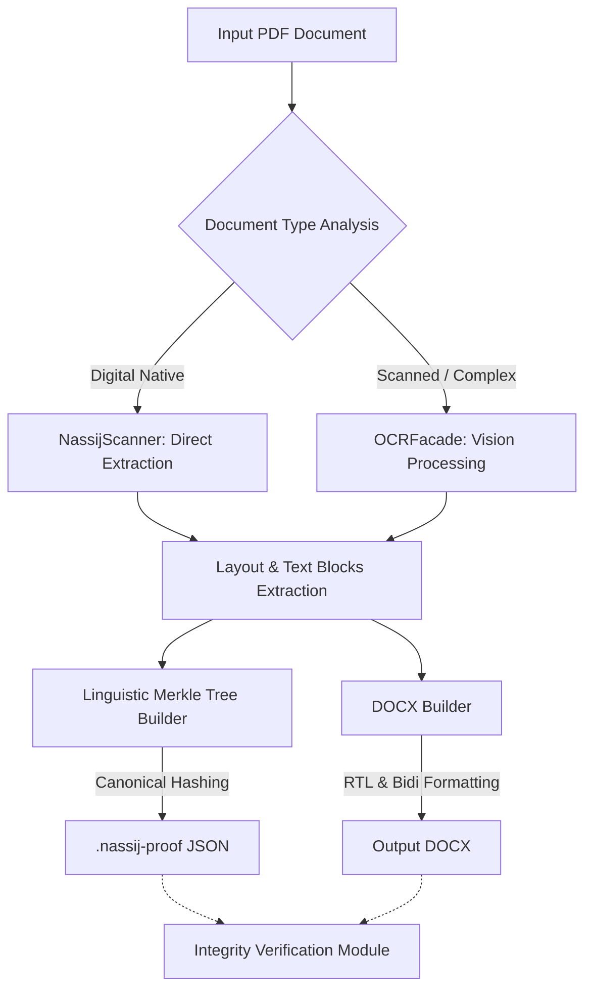
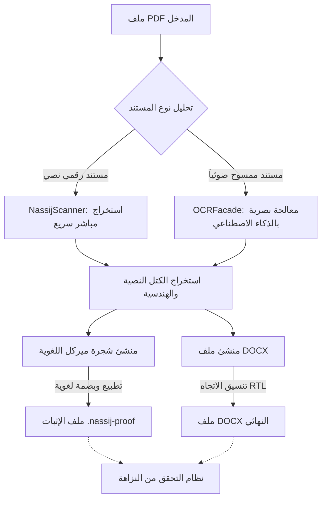

# Nassij Engine V3.0
## The Advanced Arabic Document Weaver

Nassij is a next-generation Arabic document reconstruction engine. It does not just convert files; it re-weaves them. By combining high-precision OCR, directly reading digital PDFs, culturally-rooted typography, and institutional-grade layout logic, Nassij delivers the highest fidelity PDF-to-DOCX transformation available for the Arabic script. Additionally, it provides cryptographic integrity proofs for legal and academic documentation.

---

## Project Vision
Nassij is built on the philosophy that Arabic technology should be highly functional and visually accurate. Our aesthetic treats the Arabic script as a living visual material, merging ancient calligraphic logic with modern digital structures.

---

## Architecture Flow



---

## Key Features

### Linguistic Merkle Trees (Integrity Layer)
- **Cryptographic Verification**: Generates `.nassij-proof` JSON files leveraging Merkle trees to seal document contents.
- **Canonical Arabic Hashing**: Normalizes Arabic diacritics, presentation forms, and removes Kashida before hashing, ensuring equivalent strings share the same cryptographic identity.
- **Trust and Verification**: Verifies that a generated DOCX was not tampered with post-conversion.

### Precision Reconstruction
- **Direct Copy Mode (NassijScanner)**: Extremely fast, 100% accurate extraction for digital native PDFs, bypassing OCR and extracting coordinate-perfect layouts.
- **Institutional-Grade Fidelity**: Specialized handling for complex Arabic ligatures.
- **Diacritics Preservation**: Advanced regex and Unicode normalization to preserve tashkeel.
- **RTL Sovereignty**: Native Right-to-Left (RTL) enforcement at the XML level for Microsoft Word.

### Intelligence Layers
- **Multi-Engine Strategy**: Seamless switching between EasyOCR and PaddleOCR PP-OCRv5.
- **TableMagic**: Sophisticated reconstruction of complex, merged, and borderless tables.
- **Local-First**: All processing happens on your machine. Privacy by design.

---

## Quick Start

### Installation

1. **Clone the repository**:
   ```bash
   git clone https://github.com/logiccrafterdz/nassij.git
   cd nassij
   ```

2. **Install the engine**:
   ```bash
   # Standard install
   pip install -e .
   
   # With Web UI and OCR optimizations
   pip install -e .[web,paddle]
   ```

### Running the Web Interface
Experience the Nassij UI locally:
```bash
python web/app.py
# Open http://127.0.0.1:8000
```

### CLI Usage
```bash
# Basic conversion
nassij convert input.pdf -o output.docx

# Generate a Cryptographic Proof
nassij convert input.pdf -o output.docx --proof

# Verify a generated Proof
nassij verify output.docx --proof output.docx.nassij-proof

# High-accuracy mode for scanned manuscripts
nassij convert input.pdf -o output.docx --mode accurate --dpi 400
```

---

## Quality Benchmarks

| Metric | Target | Description |
|-------|--------|-------------|
| **CER** | < 8% | Character Error Rate |
| **WER** | < 20% | Word Error Rate |
| **Ligatures** | 100% | Accuracy for complex Arabic shapes |
| **Tables** | >= 90% | Cell structure preservation |

---

## License
Licensed under the **MIT License**. Created with passion for the Arabic script by **LogicCrafterDZ**.

---

<div dir="rtl">

# محرك نسيج | الإصدار 3.0
## حل متطور لمعالجة الوثائق العربية والتوثيق المشفّر

**نسيج** هو محرك من الجيل الجديد لإعادة بناء المستندات العربية. لا يكتفي البرنامج بمجرد التحويل، بل يعيد "نسج" الملفات عبر دمج تقنيات الاستخراج المباشر للنصوص، التعرف الضوئي (OCR) عالي الدقة، وفلسفة بصرية تعتز بأصالة الخط العربي. كما يوفر طبقة حماية متقدمة لإثبات صحة ونزاهة الوثائق قانونياً وأكاديمياً.

---

## هيكلية النظام



---

## المميزات الرئيسية

### الأشجار الميركالية اللغوية (طبقة التوثيق المشفر)
- **الإثبات الرياضي**: توليد ملفات إثبات تعتمد على خوارزميات (Merkle Trees) لختم محتوى المستند وتوثيقه.
- **التطبيع اللغوي (Canonical Hashing)**: توحيد البصمة البايتية للنصوص عبر تجاهل الكشيدة، فصل التشكيل، وتوحيد أشكال الحروف (Presentation Forms)، بحيث يكون للنصوص المتطابقة لغوياً نفس البصمة المشفرة.
- **التحقق من النزاهة**: أداة مدمجة لفحص الوثائق والتأكد من عدم تعرضها للتلاعب أو التحريف بعد التحويل.

### الدقة المؤسساتية
- **الاستخراج المباشر (NassijScanner)**: سرعة فائقة ودقة 100% للمستندات الرقمية الحديثة (Digital Native) مع تجاوز الـ OCR بالكامل وبناء الهيكل هندسياً.
- **محاكاة الحرف**: معالجة متقدمة للروابط اللغوية المعقدة لتظهر بشكل صحيح في برامج التحرير.
- **حفظ التشكيل**: استخدام تقنيات النورملة الموحدة (Unicode NFC) للحفاظ على الحركات بدقة متناهية.
- **سيادة اليمين**: فرض اتجاه الكتابة (RTL) على مستوى الكود المصدري لملف الوورد لضمان التوافق المطلق.

### طبقات الذكاء الاصطناعي
- **المحركات المتعددة**: دمج ذكي بين محركات EasyOCR و PaddleOCR للحصول على أفضل قراءة ممكنة.
- **هندسة الجداول**: تقنيات ذكية لإعادة بناء الجداول المعقدة، المدمجة، وعديمة الحدود.
- **الخصوصية التامة**: جميع العمليات تتم محلياً على حاسوبك دون رفع أي بيانات للإنترنت.

---

## البدء السريع

### التثبيت

1. **تحميل المستودع**:
   ```bash
   git clone https://github.com/logiccrafterdz/nassij.git
   cd nassij
   ```

2. **تثبيت المحرك**:
   ```bash
   # التثبيت القياسي
   pip install -e .
   
   # التثبيت مع واجهة الويب ومحركات OCR المتطورة
   pip install -e .[web,paddle]
   ```

### استخدام سطر الأوامر (CLI)
```bash
# تحويل بسيط
nassij convert input.pdf -o output.docx

# تحويل مع توليد ملف إثبات التوثيق اللغوي
nassij convert input.pdf -o output.docx --proof

# التحقق من سلامة مستند تم تحويله سابقاً
nassij verify output.docx --proof output.docx.nassij-proof

# وضع الدقة العالية للمخطوطات والمسوحات الضوئية
nassij convert input.pdf -o output.docx --mode accurate --dpi 400
```

---

## معايير الجودة

| المعيار | الهدف | الوصف |
|-------|--------|-------------|
| **معدل خطأ الحرف** | أقل من 8% | نسبة الخطأ في التعرف على الأحرف (CER) |
| **معدل خطأ الكلمة** | أقل من 20% | نسبة الخطأ في التعرف على الكلمات (WER) |
| **دقة الروابط** | 100% | دقة معالجة الكلمات المركبة |
| **دقة الجداول** | أكثر من 90% | الحفاظ على بنية الخلايا والمحتوى |

---

## الترخيص
المشروع مرخص تحت رخصة **MIT**. طُوّر بشغف للحرف العربي بواسطة **LogicCrafterDZ**.

</div>
